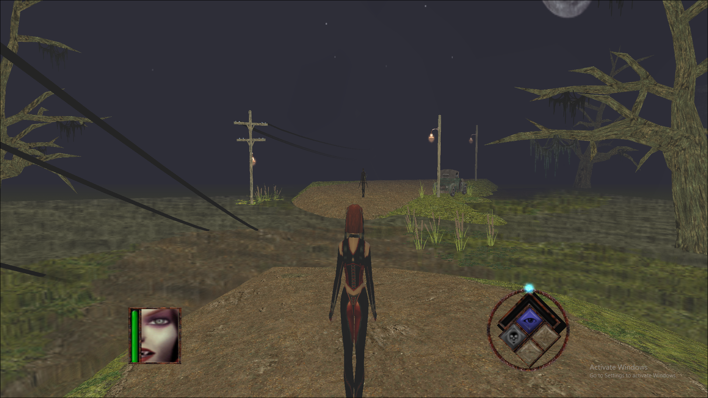
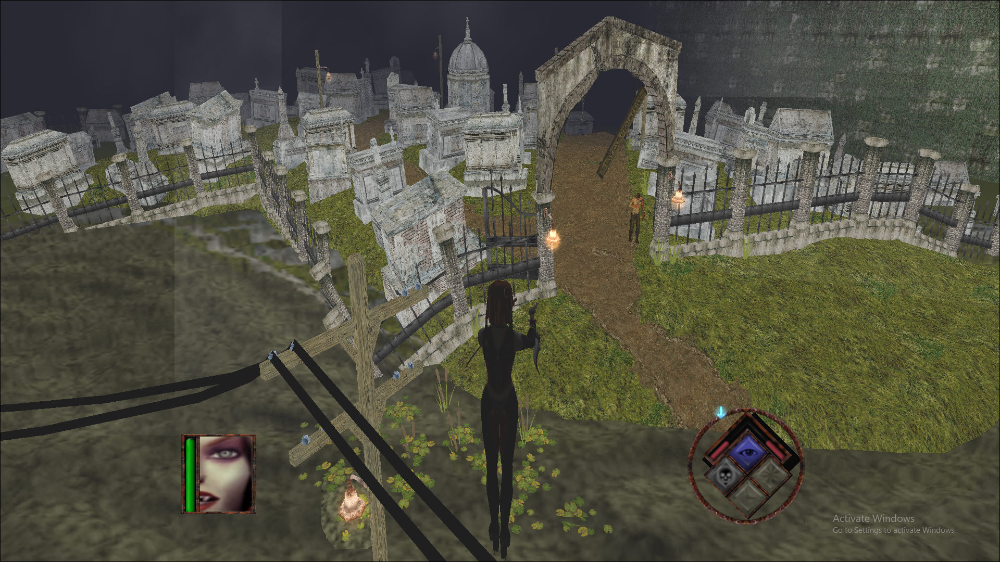

# BRRE

## What it is?

BRRE is a binary compatible open implementation of some components of the original [BloodRayne](https://en.wikipedia.org/wiki/BloodRayne_(video_game)) game. Current components include:

1. A simple video player designed to play game's cut scenes.

2. An OpenGL 1.2 game renderer.

3. An incomplete DirectX 8.1 game renderer.

The code was developed and tested with the GOG's original version of the game. You need to own the original game with all of its resources in order to play the game.

## What it is not?

This is not a complete game. Please purchase software you like!

## How to build?

Build requirements:

1. Microsoft Visual Studio 2022 with C++ SDK.
2. R.OpenGL.1.2.dll
   1. Dependency on Windows's OpenGL implementation.
3. R.DirectX.8.1.dll
   1. DirectX 8.1 SDK.
   2. Requires DirectX 8.1 include files to be copied under &lt;BRRE&gt;\SDK\DX81\Inc
   3. Requires DirectX 8.1 library files to be copied under &lt;BRRE&gt;\SDK\DX81\Lib

## How to use?

1. Clone the repository and build it with the Visual Studio.

2. CutScene.exe
   
   1. Copy the file from &lt;BRRE&gt;\Bin\Win32\Release\ to &lt;Game&gt;\video\

3. R.OpenGL.1.2.dll
   
   1. Rename R.OpenGL.1.2.dll in &lt;BRRE&gt;\Bin\Win32\Release\ to trigl.dll
   
   2. Copy the file from &lt;BRRE&gt;\Bin\Win32\Release\ to &lt;Game&gt;\ and overwrite the original file.

4. R.DirectX.8.1.dll

   1. **Note**: the implementation is incomlete and extremelly buggy. Only main menu and level loading screens work properly.

5. Play the game!

## Help Wanted!

### General

1. Bug fixes.

2. Names of the fields in the data structures and their use.

3. Improvements and enhancements.

4. New renderers with the newer versions of graphics APIs.

   1. Note: As additional projects in the solution.

### DirectX

Help wanted with finishing the implementation of the renderer in the first place. Current issues include:

1. Invalid renderer state, such as: texture blending.

2. Issues with transforms, both, in HAL and fixed pipelines modes.

3. Issues with textures use and bump mapping.

4. Probably many more.

## Screen Shots!

### OpenGL 1.2

## Legal

DirectX, OpenGL, and BloodRayne are trademarks of their respective owners.